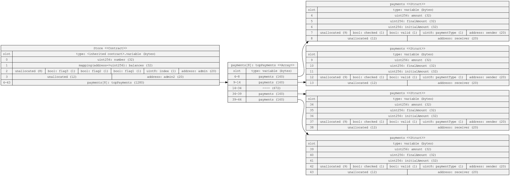

### Optimizing Storage

_Take this `Store` contract. Use the sol2uml tool to find out how many storage slots it is using._

_By re ordering the variables, can you reduce the number of storage slots needed ?_

### Answer

**Original Code**

```solidity
// SPDX-License-Identifier: UNLICENSED
pragma solidity ^0.8.13;

contract Store {
    struct payments {
        bool valid;
        uint256 amount;
        address sender;
        uint8 paymentType;
        uint256 finalAmount;
        address receiver;
        uint256 initialAmount;
        bool checked;
    }
    uint8 index;
    uint256 public number;
    bool flag1;
    address admin;
    mapping(address => uint256) balances;
    bool flag2;
    address admin2;
    bool flag3;
    payments[8] topPayments;

    constructor() {}

    function setNumber(uint256 newNumber) public {
        number = newNumber;
    }

    function increment() public {
        number++;
    }
}
```

After running `sol2uml storage --contract Store Homework.sol`, we get the following storage layout image:


**Optimized Code (My approach)**

```solidity
// SPDX-License-Identifier: UNLICENSED
pragma solidity ^0.8.13;

contract Store {
    struct payments {
        uint256 amount;
        uint256 finalAmount;
        uint256 initialAmount;
        address sender;
        uint8 paymentType;
        bool valid;
        bool checked;
        address receiver;
    }
    uint256 public number;
    mapping(address => uint256) balances;
    address admin;
    uint8 index;
    bool flag1;
    bool flag2;
    bool flag3;
    address admin2;
    payments[8] topPayments;

    constructor() {}

    function setNumber(uint256 newNumber) public {
        number = newNumber;
    }

    function increment() public {
        number++;
    }
}
```

Upon running `sol2uml storage --contract Store Homework.sol` again, we obtain the following optimized storage layout:



Tools Used:

- [sol2uml](https://github.com/naddison36/sol2uml)
- [prettier-plugin-solidity](https://github.com/prettier-solidity/prettier-plugin-solidity)

### Is this valid solidity?


The contract compiles. The provided solidity code is valid. The argument is a function that itself takes a series of nested functions as arguments. Each of these nested functions takes another function as an argument, ultimately ending with a function that takes no arguments and is declared as external pure.
